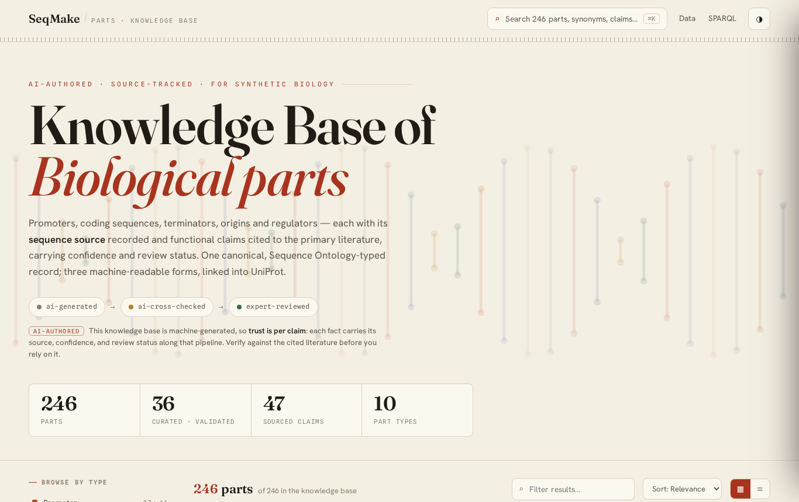
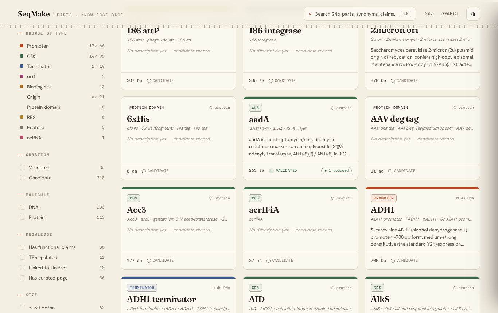
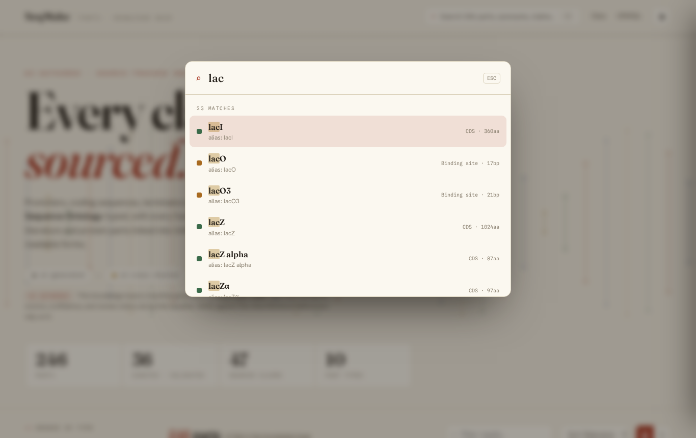
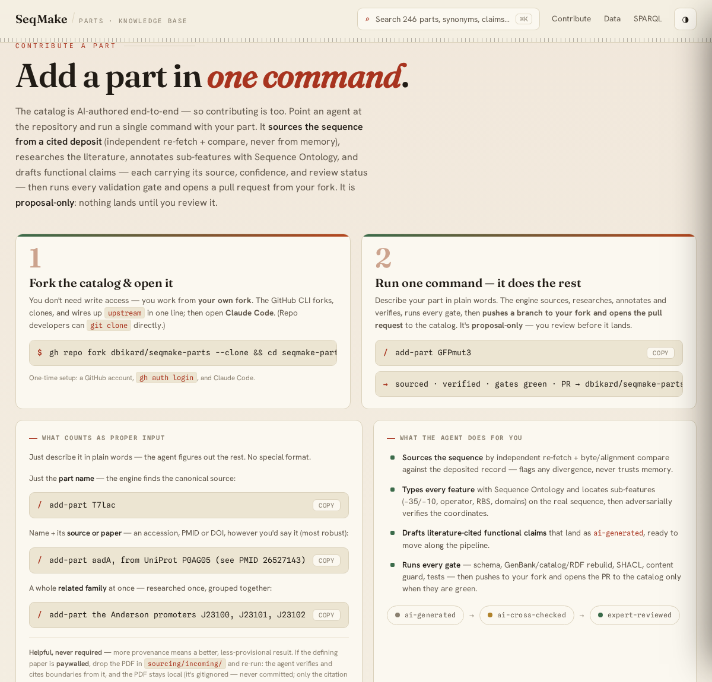
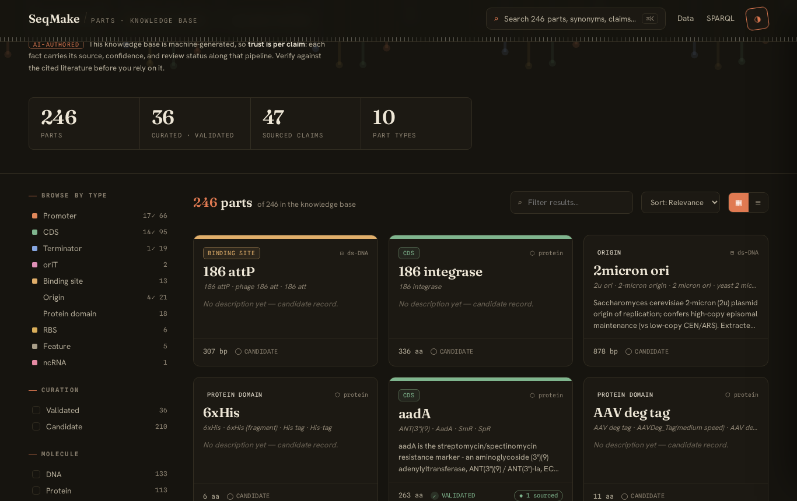

# Site redesign proposal — *Knowledge Base of Biological parts*

A proposal to replace the current auto-generated MkDocs **Material** theme (default
teal, generic layout, stock search) with a **distinctive, data-driven knowledge-base
front-end** whose centrepiece is a complete navigation + search system, and whose
identity foregrounds the project's real distinction: it is **AI-authored and shows its
evidence** — every fact and claim carries a source, confidence, and review status.

**Working prototype:** [`index.html`](index.html) — open it directly in a browser
(or `python3 -m http.server` in this folder). It runs on a **94 KB index extracted
from the real `catalog.json`** ([`build_index.py`](build_index.py) → `data.js`),
all **246 parts**, no server or build step required.

### Preview (rendered in Chromium, real data)

| | |
|---|---|
|  |  |
|  |  |

> **Note:** these shots predate the latest changes — the slide-over drawer is now a **full-page detail**
> (§3E) and the verification copy uses the new model (no `expert-reviewed`). An in-browser refresh of the
> screenshots is the remaining visual pass.

---

## 1 · Why change

The current site is a stock MkDocs Material instance. It's serviceable but:

- **Looks like every other docs site.** Teal palette, default cards, no point of view.
  Nothing signals *"an AI-authored, source-tracked knowledge base."*
- **Search is a documentation search**, not a *catalog* search. It indexes page prose;
  it doesn't let you slice by **type × status × molecule × regulator × size × knowledge
  layer** — which is exactly how a synthetic biologist looks for a part.
- **Browsing is flat.** Type pages are long Markdown tables; there's no faceting, no
  instant filter, no way to combine "validated promoters regulated by LacI under 60 bp."
- **The data's richest dimensions are invisible**: synonyms (the alias you actually
  search by), functional claims + their review status, UniProt links, TF regulation.

## 2 · Concept — *a sourced knowledge base of biological parts*

The headline **says what it is** — a knowledge base of **biological parts** (promoters,
CDSs, terminators, origins, regulators) — while the accent word carries the project's real
distinction: it is **AI-authored and shows its work**. Every annotation and functional
claim carries its source, confidence, and a review status moving along a pipeline
(`ai-generated → ai-cross-checked → expert-reviewed`). The design makes **provenance the
hero**, not record-keeping.

So the hero reads **"Knowledge Base of *Biological parts*"** (eyebrow: *AI-authored ·
source-tracked · for synthetic biology*) — it says plainly what the thing is, while the
eyebrow, subtitle, and pipeline carry the provenance story. It renders that trust pipeline
as a visible motif; cards surface a
`◆ N sourced` provenance pill and a clean *curated* check; the detail drawer's centre of
gravity is the **Sourced claims** block, each claim tagged with its review status. The
tone is **warm but modern** — a refined, source-tracked reference, not an antique catalog.

### Design system

| | |
|---|---|
| **Display** | **Fraunces** — a characterful variable serif with optical sizing; the masthead, part names, and stats. Not a generic sans. |
| **UI / body** | **Hanken Grotesk** — clean, slightly warm humanist sans for controls and prose. |
| **Mono** | **Spline Sans Mono** — sequence coordinates, lengths, accessions, SO terms, review-status pills. |
| **Surface** | Warm "bone" surface `#F4EFE3`, clean (no grain), with a faint **DNA-helix watermark** in the hero. A **dark mode** (toggle, persisted). |
| **Accent** | **Madder/oxblood** `#A8341F` for actions & focus; **green** for the evidence/knowledge layer (sourced claims, the *curated* check); **gold** as the mid-stage provenance signal. |
| **Provenance motif** | The `ai-generated → ai-cross-checked → expert-reviewed` pipeline appears as a hero element and again per-claim in the drawer (status pills). Validated parts get a clean green ✓ rather than a wax seal. |
| **Base-pair palette** | Each Sequence-Ontology **type gets a signature hue** (promoter = madder, CDS = moss, terminator = slate, origin = indigo, RBS = amber …) used consistently across the type "tape" on cards, facet dots, chips, and the palette. Color *encodes the taxonomy*, it isn't decoration. |
| **Motion** | One orchestrated page-load: the coordinate rule draws in, hero text rises staggered, cards fade-up in sequence. Card hover "develops" the base-pair tape strip. Palette scales in over a blurred scrim. All gated behind `prefers-reduced-motion`. |

A **part card** carries: the type's color tape, a type chip, the name in Fraunces,
synonyms, a 3-line description, then a footer with size (mono), molecule, a **green ✓
validated / hollow candidate** badge, and a `◆ N sourced` provenance pill.

## 3 · Navigation & search — the complete spec

This is the part the brief asked to get right. Five coordinated surfaces, **all working
in the prototype** against real data:

### A. Command palette (`⌘K` / `Ctrl-K` / `/`)
- Fuzzy, weighted, multi-token scoring over **name, slug, synonyms, description,
  transcription factor, regulated targets, source accession, UniProt id, type, SO name.**
  Exact-name and prefix hits rank first; every token must match somewhere.
- **Why-matched hint** per result (e.g. shows *"alias: SmR"* when you found `aadA` by
  synonym) + match highlighting.
- Full keyboard model: open, `↑/↓` to move, `Enter` to open, `Esc` to close.
- **Quick presets** ("Validated promoters", "TF-regulated", "Selection markers",
  "Origins", "Has functional claims") that seed facets in one click.
- Empty state when nothing matches.

### B. Faceted rail (left) — multi-select, composable
- **Type** (all 10, with `validated✓ / total` counts and the taxonomy color dot)
- **Curation** — validated / candidate
- **Molecule** — DNA / protein
- **Knowledge layer** — has functional claims · TF-regulated · linked to UniProt · has curated page
- **Size** — ≤50 / 51–200 / 201–1000 / >1000 bp·aa buckets (live counts)
- **Collections** — auto-populated; hides itself when empty

### C. Results toolbar
- Live **result count** ("*N* of 246 in the knowledge base"), a **quick-filter** box (free text
  over the grid, independent of the palette), **sort** (relevance / name / largest /
  smallest / most claims / validated-first), and a **grid ⇄ compact-table** toggle.

### D. Active-filter chips
- Every active facet + search term renders as a removable chip with a **clear-all**.

### E. Full-page part detail (same design, no MkDocs)
- Click any card/row → a **full-page detail view in the same design** (URL `#part=<slug>`,
  shareable, back/forward via the History API). It carries the complete record: the **embedded
  sequence/feature widget** (`seqmake-part-view`, hydrated via `SeqmakePartView.init()`),
  description, an SO/length/molecule/accession/refs meta line, **synonyms**, **regulated-by /
  regulates**, the **full functional claims** — each with its source quote + link and its
  **confidence + usefulness** badges (cross-checked when verified) — and the **references**.
  Plus get-this-part actions: live site, GenBank / FASTA / RDF, UniProt, and the JSON record.
  This replaces both the old slide-over drawer *and* the MkDocs part page.

### Shareable & accessible
- **All state is encoded in the URL hash** (`#q=…&type=…&status=…&sort=…`) so any search
  or filtered view is a shareable link and survives reload.
- Focus-visible rings, `aria-pressed` facets, dialog roles, keyboard-first palette.

## 4 · What's real vs. stubbed in the prototype

- **Real:** all 246 parts and their type/status/molecule/length/synonyms/collections/
  TF-regulation/claim-counts/UniProt links, pulled from `catalog.json`. Every search,
  facet, sort, chip, URL-hash, and drawer is live. Download/full-page links point at the
  real `dbikard.github.io` part URLs.
- **Stubbed (by design):** the per-part **sequence viewer**. The live site already has a
  vendored `seqmake-part-view.js` widget — the redesign **keeps it** on detail pages; the
  drawer's coordinate ruler is just a lightweight preview. Functional-claim *labels* in
  the drawer are summarised from claim `type` (the index carries counts/types, not full
  claim prose) — the real build would inline the full claim text.

Verified end-to-end with a fake-DOM harness running the page's own script over the real
data: 18/18 assertions (246 cards; validated→36; promoter→66; synonym search finds
`aadA` via *"spectinomycin"*; table view; hash state; drawer). No browser was available
in this environment, so a **visual pass in a real browser is the remaining check.**

## 5 · Contribute — *add a part in one command*

The landing page carries a **Contribute** section (linked from the masthead) that
onboards new contributors. Its promise: **adding a part is a single command in an AI
agent.**

The engine itself **already exists** — it doesn't need building, only surfacing and a
fork-aware PR step. The repo ships a `/add-part` Claude Code command
(`.claude/commands/add-part.md`) that drives the proposal-only `annotate-part` engine
(`.claude/workflows/annotate-part.js`) end-to-end: **source** the sequence (independent
re-fetch + byte/alignment compare via `tools/source_finder.py`, never from memory) →
**research** the literature → **locate + adversarially verify** sub-features →
**synthesise** a `part.schema.json`-shaped proposal with cited functional claims → safe
additive **merge** (`tools/merge_part.py`, which never clobbers reviewed claims) → run
**every gate** (validate / build / RDF / SHACL / content / tests).

**The main use case is a contributor *without* write access**, so the flow is built around
a **fork** — the standard GitHub model. It stays a genuine two-step flow because the GitHub
CLI forks + clones + sets `upstream` in a single line, and `/add-part` itself opens the
cross-fork PR at the end. The section presents **two steps** with copy-to-clipboard
commands:

1. **Fork the catalog & open it** —
   `gh repo fork dbikard/seqmake-parts --clone && cd seqmake-parts && claude`.
   One-time setup: a GitHub account, `gh auth login`, Claude Code. (Repo developers can
   `git clone` directly.)
2. **Run one command — it does the rest** — `/add-part GFPmut3` (plain-words input). The
   engine sources, researches, annotates, verifies, runs every gate, then **pushes a branch
   to your fork and opens the pull request** to the catalog. Proposal-only — you review
   before it lands.

Input is **plain natural language**, never JSON: a bare name (`/add-part T7lac`), a name +
its source or paper (`/add-part aadA, from UniProt P0AG05 (see PMID 26527143)`), or a
family (`/add-part the Anderson promoters J23100, J23101, J23102`). The command parses it
into the engine's args. **References and PDFs are nudged as optional accelerators, never
required** — a citation (accession / PMID / DOI) seeds the Source phase, and for a paywalled
paper the contributor can drop the PDF in the gitignored `sourcing/incoming/` so the agent
verifies + cites boundaries from it (the PDF stays local; only the citation is committed).
The agent also asks for these **contextually** — only when sourcing or a boundary is
blocked — rather than demanding them upfront, so the "just type a name" floor holds.
Two panels spell out **what counts as proper input** and **what the agent does for you**,
and the section reuses the `ai-generated → ai-cross-checked → expert-reviewed` pipeline so
contributing reads as *the same provenance model* the rest of the site is built on: a
contribution lands as `ai-generated`, sourced from day one, and moves along the pipeline
under review. It links out to `CONTRIBUTING.md`, `AUTHORING.md` (the SOP), and the schema,
and notes the by-hand path (`tools/new_part.py`) and CC BY 4.0 licensing.

**Now wired into the command (not just the prototype):** `.claude/commands/add-part.md`
gained a *step 7* that finalizes the PR **fork-aware** — for an outside contributor it
branches, pushes to their fork (`origin`), and runs `gh pr create --repo
dbikard/seqmake-parts` (gh routes the cross-fork PR); for a maintainer it pushes a branch
or to `main` per policy; and it never opens a PR when step 6 escalated. The command also
now states explicitly that `$ARGUMENTS` is natural language to be parsed, never JSON the
contributor must write. The remaining nicety is a no-clone hosted path (e.g. Codespaces)
so a contributor needn't install anything locally.

## 6 · How this lands on the real site

**The SPA design owns the whole site — index *and* part detail (MkDocs retired).** The prototype
now renders the full part detail in the same design (§3E), so MkDocs is no longer the detail target.
`tools/build_catalog.py` would emit: the `index.html` + `parts_index.json` landing page, and the
per-part detail payload (full claims + references + the widget's `MoleculeInfo`, the shape already in
`data.js`).

**Hard requirement — preserve the canonical part URLs.** The per-part pages at
`…/parts/<slug>/` are the targets of the **live `w3id.org/seqmake/parts` IRIs** and the
agent-access `index.json` (`page`/`record`/`genbank`/`fasta`/`rdf`). So production must generate a
**static per-part page at the same URL** (`parts/<slug>/index.html`) in the SPA design — *not* a
client-only `#part=` route — or those live identifiers break. The `#part=` hash route in the
prototype is the in-page navigation; the build emits the matching static pages for direct/IRI access.

**Next steps**
1. Confirm aesthetic direction (or pick dark-default).
2. Promote `build_index.py` into `tools/build_catalog.py` (emit `parts_index.json` + per-part payload).
3. Emit a **static `parts/<slug>/index.html`** per part in this design (preserving the canonical URLs),
   embedding the `seqmake-part-view` widget — replacing the generated MkDocs part page.
4. Visual QA in-browser (light/dark, mobile rail collapse, the live widget), Lighthouse/a11y pass.
